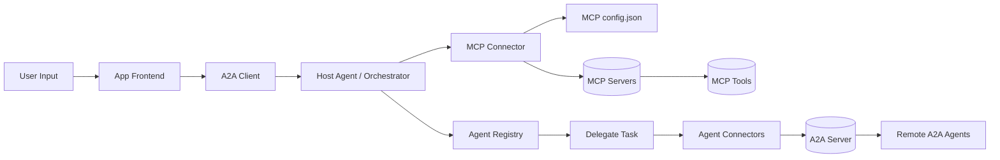

# Multi Agent Orchestration with MCP and A2A

This project is an early-stage implementation of a multi-agent orchestration system built around the Model Context Protocol (MCP) and A2A-style coordination.

The system is organized into a few layers:

- a frontend where the user submits input
- a host agent / orchestrator layer
- an MCP connector that reads `mcp config.json` and lists available servers
- an agent registry that can list agents and delegate tasks
- remote A2A agents
- multiple MCP servers with reusable tools

## Architecture Overview



## Project Status

**Status:** Early development  
**Phase:** Architecture foundation and connector prototypes  
**Current focus:** Wiring the terminal MCP server, the arithmetic HTTP MCP server, and Claude Desktop connectors into a larger A2A/MCP workflow

## What This Project Is About

This repository is a practical build of that architecture. The goal is to grow from a small set of working MCP connectors into a fuller multi-agent orchestration system.

Current work includes:

- Model Context Protocol for tool integration
- Claude Desktop as the local frontend
- A terminal MCP server for controlled command execution
- A streamable HTTP arithmetic MCP server for remote connector testing
- The first pieces of the broader A2A orchestration flow

## Current Highlights

- FastMCP-based terminal server is working locally
- Streamable HTTP arithmetic server is running on `http://localhost:3000`
- Claude Desktop config includes both local and remote connector entries
- Desktop workspace issues were fixed for the terminal server
- Project progress and fixes are tracked in dedicated Markdown files

## Architecture In Progress

The current repository covers the first working slices of the system:

- MCP Servers: terminal server and arithmetic server
- MCP Connector: Claude Desktop remote connector entry for `mcp-remote`
- MCP Client flow: server discovery through Claude Desktop config

Planned next layers are:

- App frontend
- A2A client
- Host agent / orchestrator
- Agent registry
- Task delegation to remote A2A agents

## Project Structure

- `mcp/servers/terminal_server/terminal_server.py` - MCP server for running terminal commands
- `mcp/servers/streamable_http_server.py` - Streamable HTTP MCP server for arithmetic testing
- `FIXES.md` - Detailed log of fixes, file changes, and reasoning
- `PROJECT_STATUS.md` - Progress tracker and GitHub push history
- `main.py` - Project entry point or placeholder script
- `pyproject.toml` - Python project configuration
- `uv.lock` - Locked dependency state for `uv`

## MCP Server Overview

The terminal MCP server exposes a command tool that:

- accepts a command string
- runs it through `subprocess`
- returns command output or errors
- uses a stable default workspace on the Desktop

This lets Claude Desktop interact with local commands without depending on a fragile working directory.

The arithmetic MCP server exposes an `add_numbers` tool and runs as a streamable HTTP service on `http://localhost:3000` for remote connector testing.

## Setup

### 1. Create the virtual environment

```powershell
uv venv
```

### 2. Activate it on Windows PowerShell

```powershell
.\.venv\Scripts\Activate.ps1
```

### 3. Install dependencies

```powershell
uv add "mcp[cli]"
```

### 4. Configure Claude Desktop

Add the MCP server entries in `claude_desktop_config.json`.

```json
{
	"mcpServers": {
		"terminal_server": {
			"command": "C:/Users/saad0/.local/bin/uv.exe",
			"args": [
				"--directory",
				"D:/Work/A_Self/AAProjects/Multi_Agent_Orchestration_with_MCP_and_A2A/mcp/servers/terminal_server",
				"run",
				"terminal_server.py"
			]
		},
		"arithmetic_server": {
			"command": "npx",
			"args": [
				"-y",
				"mcp-remote",
				"http://localhost:3000/mcp/"
			]
		}
	}
}
```

## Roadmap

Planned improvements include:

- building the app frontend
- adding the host agent / orchestrator layer
- implementing agent registry and delegation flows
- adding more MCP servers and tools
- connecting remote A2A agents
- documenting the full end-to-end orchestration flow more clearly

## Notes

This repository is intentionally being built incrementally. The README will evolve as the architecture becomes more complete.

## License

No license has been added yet.