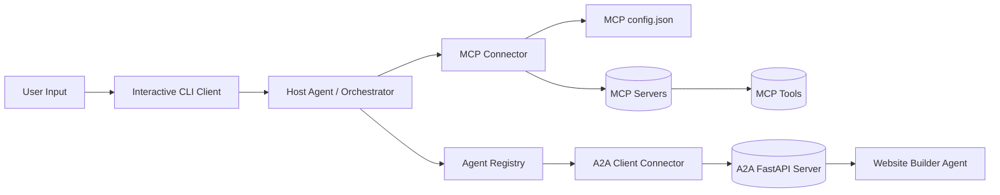

# Multi-Agent Orchestration with MCP and A2A

This repository contains a fully implemented, production-ready multi-agent orchestration system. The architecture seamlessly integrates the **Model Context Protocol (MCP)** with **Agent-to-Agent (A2A)** communication patterns. It features a central host orchestrator, specialized child agents, and direct integration with local and remote tool servers.

The system is fully operational and managed via a user-friendly interactive CLI console.

---

## Architecture Overview



### Core Architecture Layers:

1. **Interactive CLI Client (`app/cmd/cmd.py`)**
   - The user-facing terminal interface that handles active command loops, prompts the user, and securely posts queries to the Host Agent.

2. **Host Agent / Orchestrator (`agents/host_agent/`)**
   - Built on the Google ADK `LlmAgent` using the stable `gemini-2.0-flash` model.
   - Dynamically discovers all locally registered A2A agents.
   - Connects to MCP servers to list and dynamically call external tools.
   - Decomposes high-level requests and delegates sub-tasks to child agents.

3. **A2A Client & Registry (`utilities/a2a/`)**
   - Exposes `agent_registry.json` for agent discovery.
   - Manages connections and parses the complex `StreamResponse` event stream, handling both direct message payloads and task status updates (`TASK_STATE_WORKING`, `TASK_STATE_COMPLETED`, etc.) with full error propagation.

4. **Specialized A2A Agents (`agents/website_builder_simple/`)**
   - Dedicated FastAPI-based microservices that receive delegated tasks from the Host Agent and carry out specialized operations (e.g., generating page mockups and layout designs).

5. **Model Context Protocol (MCP) Servers (`mcp/servers/`)**
   - **Terminal Server**: Securely runs local commands inside a predefined workspace on the Desktop (`Desktop\Test_folder`).
   - **Arithmetic Server**: Runs as a streamable HTTP server on port 3000, exposing calculations as tools.

---

## Project Structure

* `app/cmd/cmd.py` — The interactive terminal interface.
* `agents/host_agent/` — The main orchestration agent package and uvicorn runner.
* `agents/website_builder_simple/` — A specialized HTML/CSS website generation agent.
* `mcp/servers/terminal_server/` — An MCP server to run local bash/terminal commands.
* `mcp/servers/streamable_http_server.py` — A remote HTTP MCP server for math functions.
* `utilities/a2a/` — Client connection modules, state handlers, and registry database.
* `utilities/mcp/` — Independent discovery and tool injection layers for the Google ADK runner.
* `scripts/` — Automation scripts to manage starting and orchestrating the system services.
* `pyproject.toml` — Project manifest and dependencies.

---

## Setup & Initialization

### 1. Create and Activate the Virtual Environment

```powershell
uv venv
.\.venv\Scripts\Activate.ps1
```

### 2. Configure Environment variables

Create a `.env` file in the root directory:
```env
GEMINI_API_KEY=your_gemini_api_key_here
```
*(Note: `.env` is automatically ignored from git commits by the `.gitignore` rules).*

### 3. Start the System

You can run the entire multi-agent system using the automated orchestration script or manually one-by-one.

#### Option A: Unified Automatic Startup (Recommended)

Run the combined PowerShell script. It automatically launches the servers in separate windows and waits until their ports are fully active before starting the interactive CLI in the current window:

```powershell
.\scripts\start_all.ps1
```
*(If your execution policy blocks it, run `powershell -ExecutionPolicy Bypass -File .\scripts\start_all.ps1`)*

#### Option B: Step-by-Step Manual Startup

Open four separate terminals, activate the virtual environment, and run the following in order:

1. **Start MCP Server (Port 3000)**
   ```powershell
   uv run .\mcp\servers\streamable_http_server.py
   ```
2. **Start Website Builder Agent (Port 10000)**
   ```powershell
   uv run python -m agents.website_builder_simple
   ```
3. **Start Host Orchestrator Agent (Port 10001)**
   ```powershell
   uv run python -m agents.host_agent
   ```
4. **Launch Interactive CLI**
   ```powershell
   uv run python -m app.cmd.cmd
   ```

---

## Future Enhancements

* **GUI Dashboard**: Build a modern web interface to track agent coordination visually.
* **Complex Agent Workflows**: Add more specialized child agents (e.g., Database Schema Generator, Image Generator).
* **Robust Authentication**: Implement secure JWT/mTLS token exchanges across all A2A boundaries.